# goit-no-sql-1

## Зміст

- [01_load_data.py - Результат](#01_load_datapy---результат)
- [02_transform.js - Питання та Відповіді](#02_transformjs---питання-та-відповіді)
- [part2_queries.js - Питання та Відповіді](#part2_queriesjs---питання-та-відповіді)
- [part3_aggregations.js - Питання та Відповіді](#part3_aggregationsjs---питання-та-відповіді)
- [part4_indexes.js - Питання та Відповіді](#part4_indexesjs---питання-та-відповіді)

## 01_load_data.py - Результат

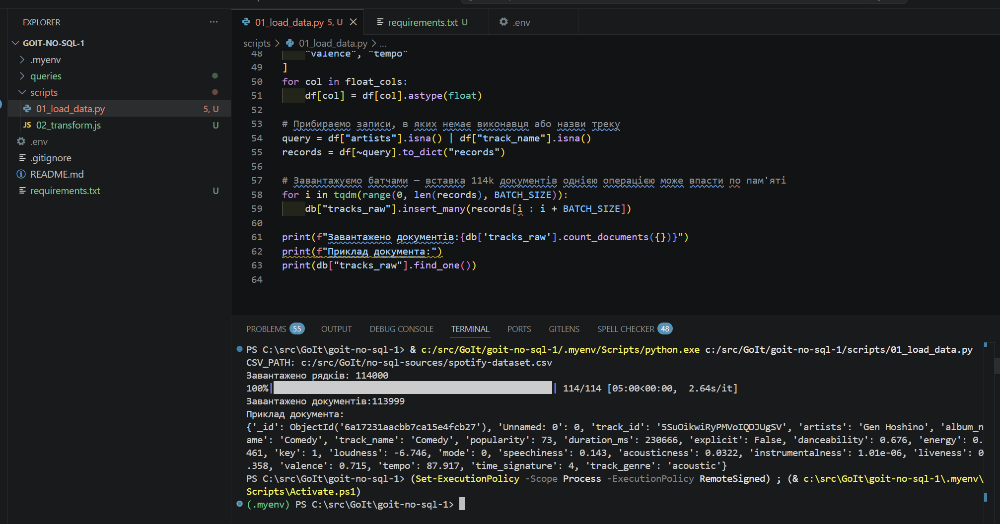
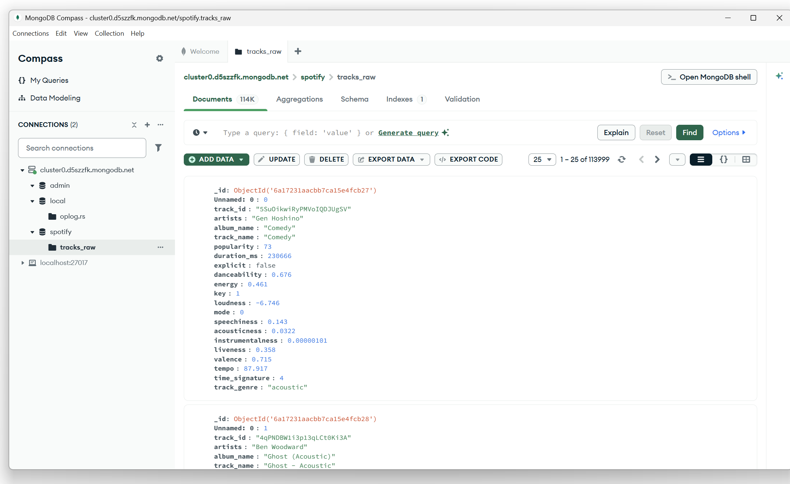

## 02_transform.js - Питання та Відповіді

### 1. Чому аудіо характеристики розміщені в окремому об'єкті `audio_features` замість плоского зберігання?

**Переваги вкладеності:**
- **Організація даних**: Пов'язані поля (danceability, energy, loudness, tempo тощо) логічно групуються разом, що робить схему більш інтуїтивною та зручною у обслуговуванні.
- **Простіший фільтр**: Запити можуть орієнтуватися на всю групу аудіо функцій як на одиницю, використовуючи `db.tracks.find({ audio_features: {...} })`.
- **Масштабованість**: Якщо в майбутньому будуть додані нові аудіо функції, вони природним чином вписуються у вкладений об'єкт без забруднення документа верхнього рівня.
- **Ясність намірів**: Відразу видно, які поля представляють метрики аудіо аналізу порівняно з метаданими треку.
- **Краща стратегія індексування**: Ви можете створити складний індекс на вкладеному об'єкті для оптимізації продуктивності.

**Проблеми, які можуть виникнути:**
- **Складність запитів**: Щоб запитати одну аудіо функцію, як danceability, ви повинні використовувати нотацію з крапкою: `db.tracks.find({ "audio_features.danceability": {$gte: 0.7} })`, що є дещо більш розгорнуто.
- **Стадії агрегування**: Доступ до вкладених полів вимагає додаткових стадій `$project` або `$unwind` у конвеєрах агрегування, що додає обчислювальні витрати.
- **Обмежена гнучкість проекції**: Ви не можете легко вибрати лише деякі аудіо функції без перебудови запиту.
- **Витрати на зберігання**: Розмір документа трохи збільшується через додаткову структуру вкладеності, хоча різниця незначна для цього набору даних.

**Краща практика**: Вкладеність корисна для пов'язаних, логічно згрупованих даних, таких як аудіо функції. Вона стає проблемою, коли ви часто запитуєте окремі вкладені поля або вам потрібен динамічний доступ до них.

### 2. Чому виконавці зберігаються як масив замість рядка? Які запити стають простішими?

**Причини використання масиву:**
- **Кілька виконавців на один трек**: Багато треків мають кількох виконавців (співпраця). Масив природно представляє цей один-до-багатьох зв'язок.
- **Атомарні операції**: Оператори масивів MongoDB дозволяють вам працювати безпосередньо з окремими елементами виконавців.
- **Цілісність даних**: Масив забезпечує, що кожен виконавець є окремою сутністю, запобігаючи помилкам аналізування.

**Запити, які стають простішими:**

```javascript
// Запит 1: Знайти треки певного виконавця (навіть у співпраці)
db.tracks.find({ artists: "The Beatles" })

// Запит 2: Знайти треки з більш ніж одним виконавцем (співпраця)
db.tracks.find({ artists: { $size: { $gt: 1 } } })

// Запит 3: Знайти треки з певною кількістю виконавців
db.tracks.find({ artists: { $size: 2 } })

// Запит 4: Оновити ім'я виконавця на всіх треках
db.tracks.updateMany({ artists: "Old Name" }, { $set: { "artists.$": "New Name" } })

// Запит 5: Додати виконавця до існуючих треків
db.tracks.updateMany({ track_id: "123" }, { $push: { artists: "New Artist" } })

// Запит 6: Агрегування з аналізом на рівні виконавця
db.tracks.aggregate([
  { $unwind: "$artists" },
  { $group: { _id: "$artists", count: { $sum: 1 } } },
  { $sort: { count: -1 } }
])
```

**Альтернатива (плаский рядок) вимагала б**: Розділення рядка та аналізування у коді програми, що робить ці операції складними та схильними до помилок.

### 3. Що таке `$out`, і чим він відрізняється від `$merge`? Коли кожен з них слід використовувати?

**Оператор `$out`:**
- **Поведінка**: Записує вихід конвеєра агрегування до колекції. Він **замінює всю колекцію**, якщо вона існує.
- **Атомарність**: Запис є атомарним — або вся колекція замінюється, або нічого не відбувається.
- **Швидкість**: Швидше для повної заміни колекції, оскільки не здійснює злиття.
- **Заміна колекції**: Створює колекцію, якщо вона не існує, або повністю перезаписує її, якщо вона існує.

**Оператор `$merge`:**
- **Поведінка**: Записує вихідні документи до колекції з більшим контролем. Може вставляти, оновлювати або замінювати документи на основі умов відповідності.
- **Детальний контроль**: Дозволяє вказати, які поля відповідають оновленням проти вставок, і як обробляти поведінку злиття.
- **Додаткові оновлення**: Може оновлювати існуючі документи або вставляти нові без заміни всієї колекції.
- **Більш гнучкий**: Підтримує опції, такі як `whenMatched` (replace, keepExisting, merge, fail) та `whenNotMatched` (insert, discard, fail).

**Коли використовувати кожен:**

| Сценарій | Використовувати `$out` | Використовувати `$merge` |
|----------|-----------|-----------|
| **Повне оновлення даних** | ✓ | ✗ |
| **Додаткові оновлення** | ✗ | ✓ |
| **Додавання нових записів** | ✗ | ✓ |
| **Трансформація та заміна колекції** | ✓ | ✗ |
| **Операції upsert** | ✗ | ✓ |
| **Зберегти старі дані, додати нові** | ✗ | ✓ |
| **Простий критичний за продуктивністю запис** | ✓ | ✗ |

**Приклад зі сценарію**: `02_transform.js` використовує `$out: "tracks"`, оскільки він виконує одноразове перетворення необроблених даних у оброблену колекцію. Оскільки це свіже перетворення (не додаткове), `$out` є доцільним.

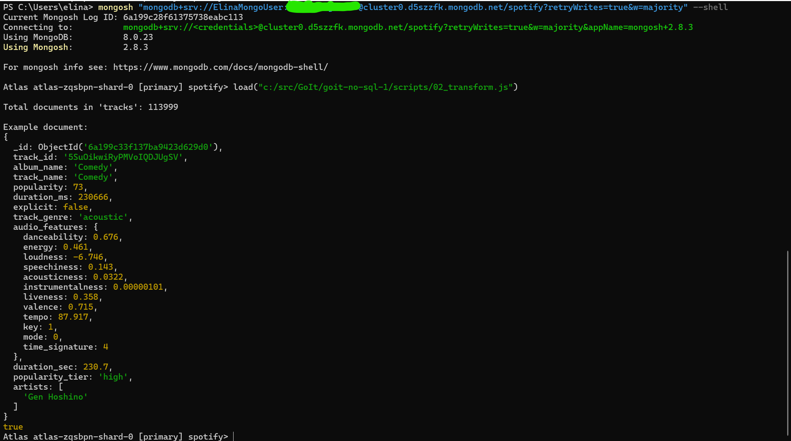
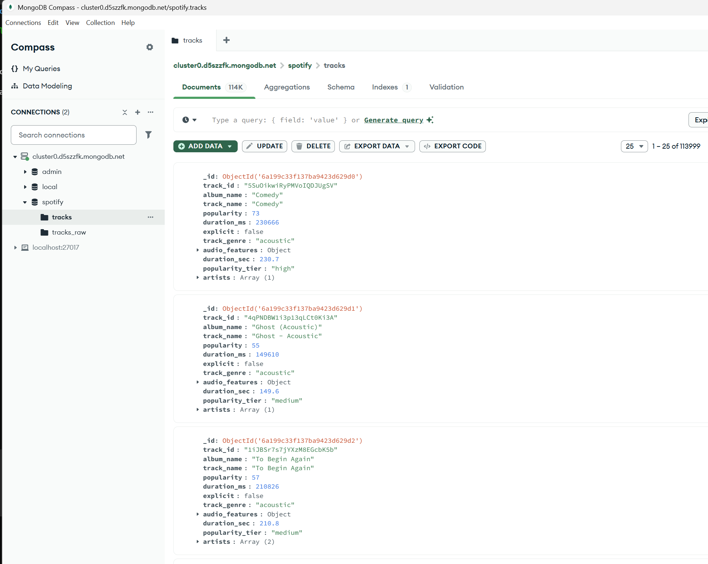

---

## part2_queries.js - Питання та Відповіді

### 1. Для чого використовується інструкція `$unwind`?

**Основна функція:**
`$unwind` — це оператор агрегування, який розгортає (розбиває) масив у кілька документів, по одному документу для кожного елемента масиву.

**Як це працює:**
Якщо у вас є документ з полем масиву, `$unwind` створює окремий вихідний документ для кожного елемента цього масиву, копіюючи всі інші поля.

**Приклад:**
```javascript
// Вхідний документ:
{ _id: 1, track_name: "Song A", artists: ["Artist 1", "Artist 2"] }

// Після $unwind: "$artists"
{ _id: 1, track_name: "Song A", artists: "Artist 1" }
{ _id: 1, track_name: "Song A", artists: "Artist 2" }
```

**Коли використовується в part2_queries.js:**
- **Завдання 2** (популярні виконавці): `$unwind` розгортає масив `artists` для групування даних за кожним виконавцем окремо.
  ```javascript
  { $unwind: "$artists" } // Кожен виконавець стає окремим документом
  { $group: { _id: "$artists", ... } } // Групуємо за кожним виконавцем
  ```

**Переваги:**
- Дозволяє працювати з масивами на рівні документа без додаткового коду в програмі.
- Спрощує агрегування та аналіз даних, які логічно структуровані як масиви (наприклад, кілька виконавців на один трек).
- Дозволяє використовувати оператори групування за елементами масиву.

**Недоліки:**
- Може значно збільшити кількість документів у конвеєрі (якщо масив містить 10 елементів, один документ стає 10).
- Вимагає більше оперативної пам'яті та обчислювального ресурсу для великих наборів даних.

### 2. Чим `$stdDevPop` відрізняється від `$stdDevSamp`?

**`$stdDevPop` (population standard deviation):**
- **Розрахунок**: Стандартне відхилення популяції (вся сукупність даних).
- **Формула**: $ \sigma = \sqrt{\frac{\sum(x_i - \mu)^2}{N}} $
- **Використання**: Коли ваш датасет є **повною популяцією**, а не вибіркою.
- **Дільник**: ділимо на $N$ (загальну кількість елементів).
- **Результат**: Більш консервативна оцінка варіативності.

**`$stdDevSamp` (sample standard deviation):**
- **Розрахунок**: Стандартне відхилення вибірки (підмножина даних).
- **Формула**: $ s = \sqrt{\frac{\sum(x_i - \bar{x})^2}{N-1}} $ (виправлення Бесселя)
- **Використання**: Коли ваш датасет є **вибіркою** з більшої популяції.
- **Дільник**: ділимо на $N-1$ (для коригування зміщення).
- **Результат**: Менш консервативна оцінка, краще для статистичних висновків.

**Порівняльна таблиця:**

| Аспект | `$stdDevPop` | `$stdDevSamp` |
|--------|--------------|---------------|
| **Формула** | $\frac{\sum(x_i - \mu)^2}{N}$ | $\frac{\sum(x_i - \bar{x})^2}{N-1}$ |
| **Дільник** | N (всього елементів) | N-1 (всього елементів мінус 1) |
| **Тип даних** | Повна популяція | Вибірка з популяції |
| **Результат** | Менший | Більший |
| **Коли використовувати** | Якщо у вас усі дані | Якщо у вас частина даних |

**Практичний приклад:**
```javascript
// У part2_queries.js (Завдання 3)
db.tracks.aggregate([
  {
    $group: {
      _id: "$track_genre",
      avg_tempo: { $avg: "$audio_features.tempo" },
      stdDev_tempo: { $stdDevPop: "$audio_features.tempo" }
      // Використовується $stdDevPop, оскільки ми розглядаємо
      // ВСІ треки кожного жанру як повну популяцію
    }
  }
]);
```

**Коли який використовувати:**
- Використовуйте **`$stdDevPop`**, якщо ви аналізуєте весь датасет (наприклад, всі треки в базі даних).
- Використовуйте **`$stdDevSamp`**, якщо ваш датасет є вибіркою для статистичних висновків про більшу популяцію.

**Практичне значення для музичної аналітики:**
У part2_queries.js для пошуку нетипових треків за темпом розраховується $stdDevPop, оскільки база даних містить всі доступні треки (повна популяція для кожного жанру), а не вибірку з бібліотеки Spotify.

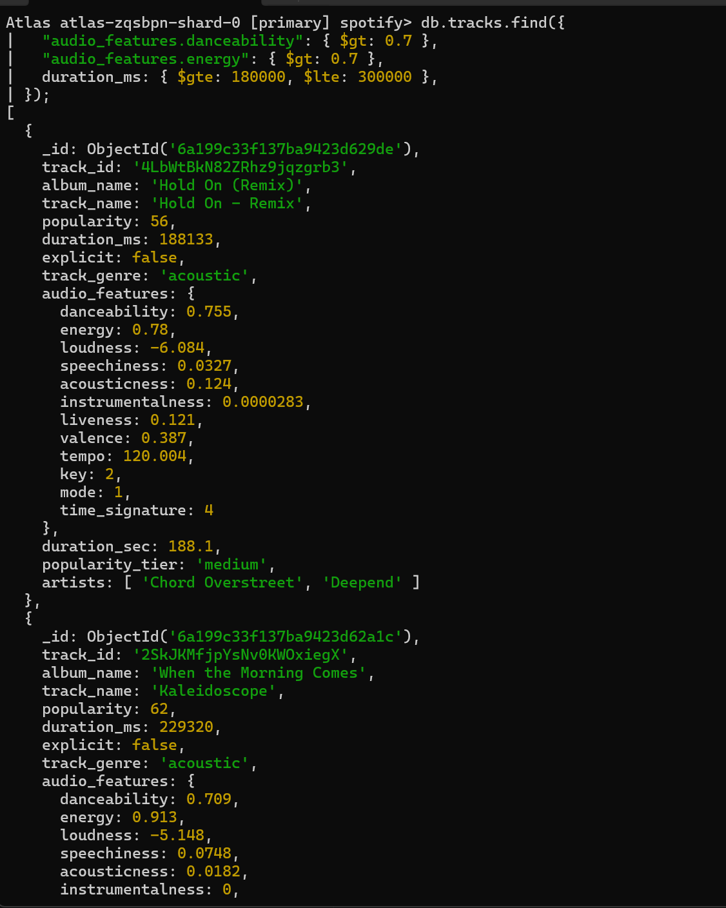
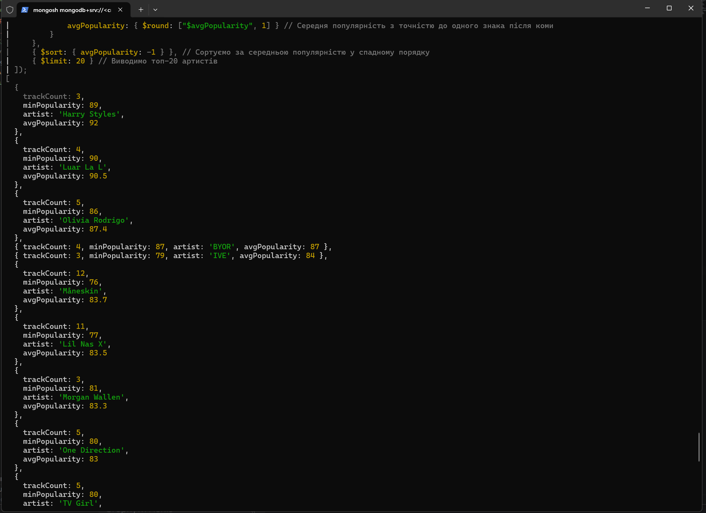
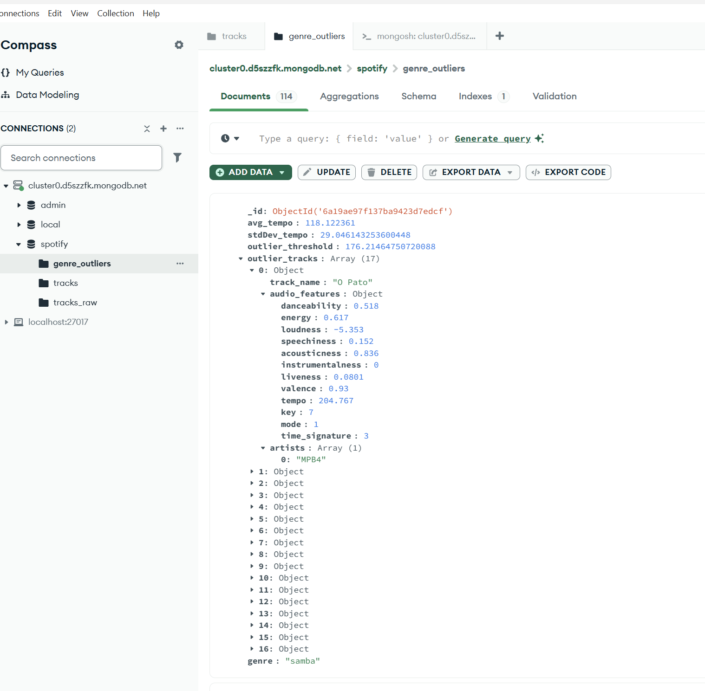
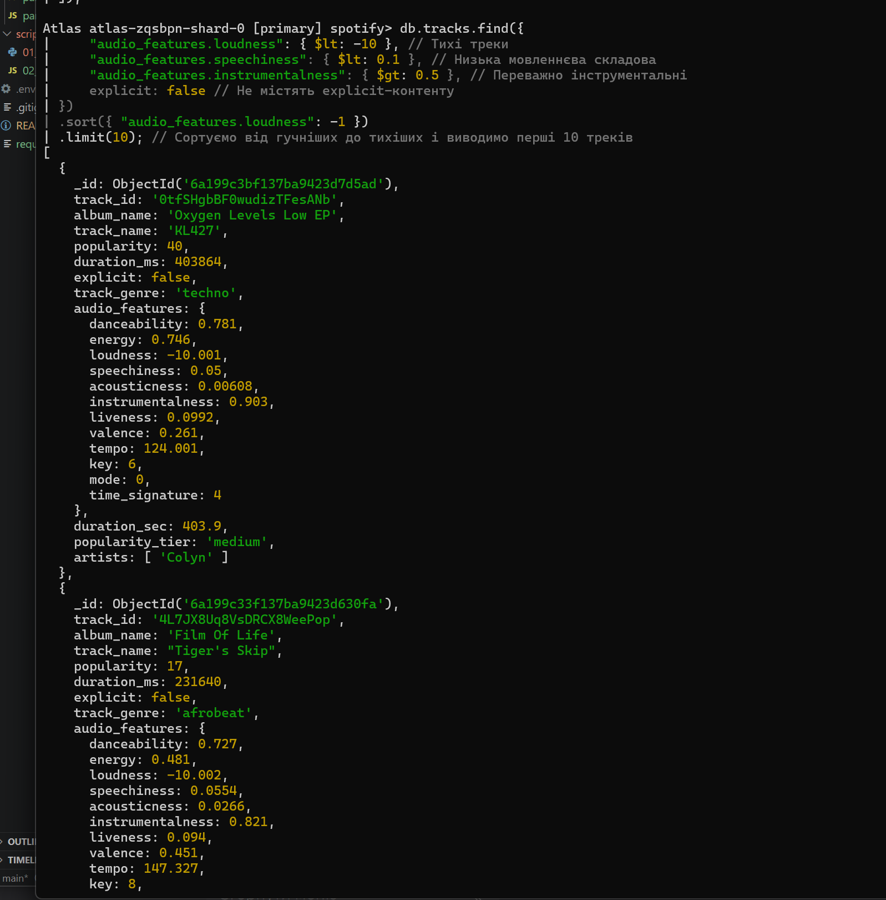

---

## part3_aggregations.js - Питання та Відповіді

### 1. У запиті 1 ми фільтруємо виконавців, у яких менше 5 треків. Як зміниться результат, якщо знизити поріг до 1? А що станеться, якщо вибирати виконавців із більш ніж 50 треками? Поясніть результат.

У запиті 1 `trackCount: { $gte: 5 }` означає, що обираються артисти з щонайменше 5 треками. Це робить середню популярність більш стабільною, бо вона обчислюється по великій кількості треків одного виконавця.

- Якщо знизити поріг до `1`, то до результату потраплять артисти з одним або кількома треками. Результат зміниться, бо тепер середня популярність для артистів з одним треком буде просто популярністю цього треку. Відповідно, у топ-10 можуть з’явитися артисти з «хітовою» одною піснею, але не обов’язково з постійно високою якістю каталогу.
- Якщо вибирати виконавців із більш ніж `50` треками, то результат стане жорсткішим і залишаться лише дуже продуктивні артисти. Таких артистів значно менше, і вони зазвичай мають стабільнішу, більш репрезентативну середню популярність. У топ-10 будуть більш «великий» артисти з довшим каталогом.

Тобто поріг `trackCount` визначає не тільки кількість результатів, а й надійність оцінки середньої популярності: менший поріг дає більш нестабільні та “шумні” результати, більший поріг — більш надійні та репрезентативні.

### 2. У запиті 3 ми фільтруємо жанри з менше ніж 100 треками. Чи зміниться результат, якщо знизити поріг до 50? Поясніть результат.

У запиті 3 `trackCount: { $gte: 100 }` відсіює жанри з малою кількістю треків, щоб зберегти статистичну надійність середніх значень danceability, energy та valence.

- Якщо поріг знизити до `50`, то до вибірки потраплять додаткові жанри з 50–99 треками. Це збільшить кількість жанрів у результаті.
- Однак додані жанри будуть менш «статистично надійними»: середні значення для них можуть більше коливатись через меншу кількість треків і бути більш впливовими одиничні аномалії.

Отже, результат зміниться тим, що індексоване ранжування може включити менші або нішеві жанри, але ці цифри будуть мати нижчу довіру порівняно з жанрами, що мали понад 100 треків.


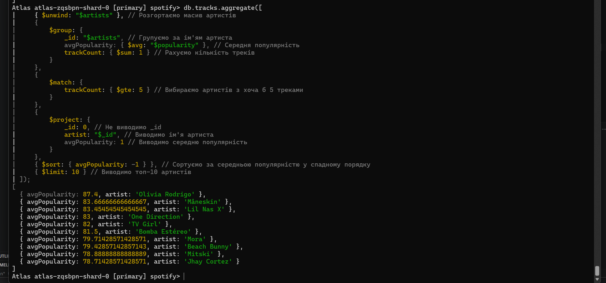
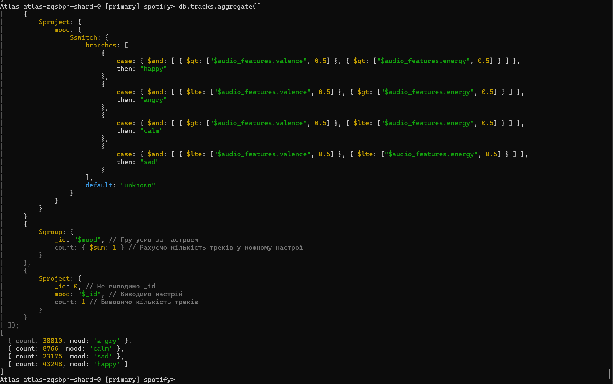
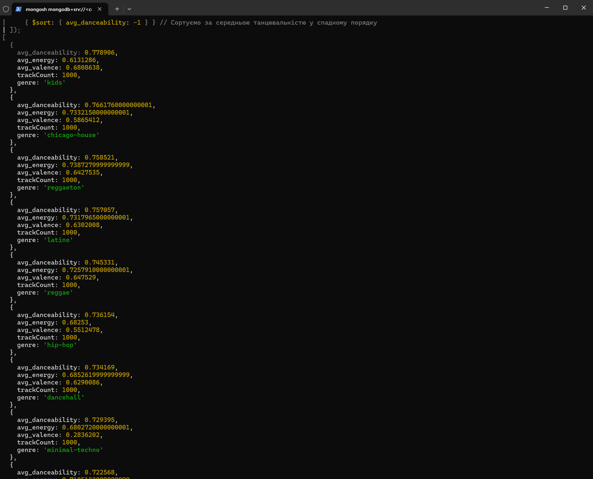

---

## part4_indexes.js - Питання та Відповіді

### Завдання 1. Аналіз запиту та індексація. Що змінилося в плані виконання? Як зрозуміти, що індекс використовується? Наведіть скріншот або значення полів із explain(), які це підтверджують.

Після сторення індексу для полів, що використовуються для пошуку, замість COLLSCAN (Collection Scan) читання в explain() результаті ми бачимо IXSCAN читання з використанням індексу.

- Кількість examined документів зменшився з 114к до 354. 
- Час виконання запиту з використанням індексу зменшився з 17 sec до 1 ms.

```javascript
db.tracks.find({
  track_genre: "pop",
  "audio_features.danceability": { $gte: 0.7 }
}).sort({ popularity: -1 })
.toArray();

db.tracks.createIndex({ track_genre: 1, "audio_features.danceability": 1 });
```


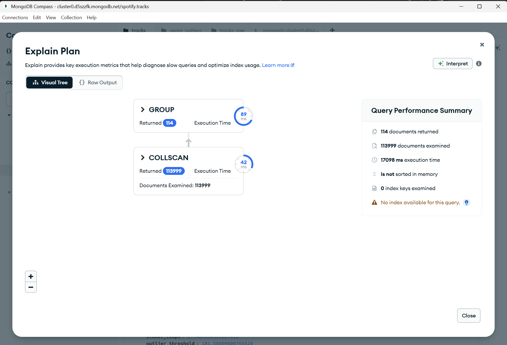
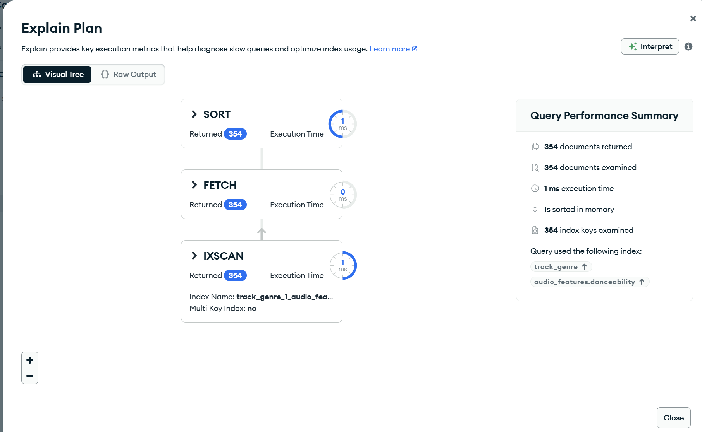


### Завдання 2. Припустимо, що ви часто шукаєте музику для роботи, використовуючи поля audio_features.instrumentalness, audio_features.speechiness та explicit. Щоб такі запити виконувалися ефективно, створіть складений індекс за цими полями та за допомогою explain() покажіть, що він використовується при виконанні пошуку.

Після сторення індексу для полів, що використовуються для пошуку, замість COLLSCAN (Collection Scan) читання в explain() результаті ми бачимо IXSCAN читання з використанням індексу.

- Кількість examined документів зменшився з 114к до 16к. 
- Час виконання запиту з використанням індексу зменшився з 690 ms до 33 ms.

```javascript
db.tracks.find({
  "audio_features.instrumentalness": { $gt: 0.5 },
  "audio_features.speechiness": { $lt: 0.1 },
  explicit: false,
});

db.tracks.createIndex({
  "audio_features.instrumentalness": 1,
  "audio_features.speechiness": 1,
  explicit: 1,
});
```

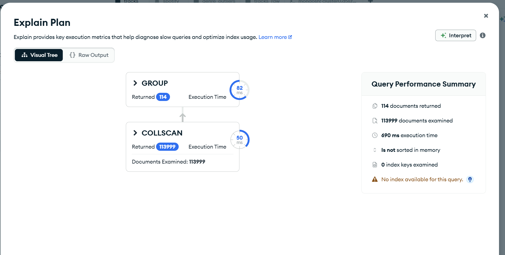
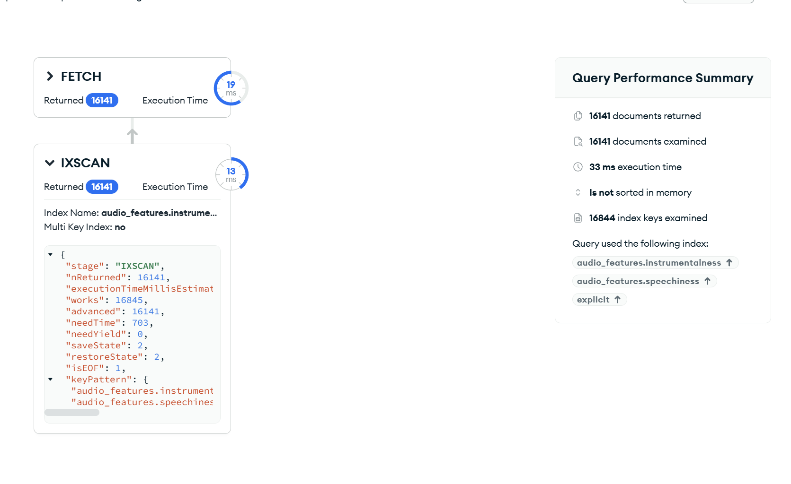

### Завдання 3. Припустимо, що індекс із завдання 1 вже існує. Чи є запит нижче покривним (covered query)?

```javascript
db.tracks.createIndex({ track_genre: 1, "audio_features.danceability": 1 }); // індекс з завдання 1

db.tracks.find({
  track_genre: "pop",
  popularity: { $gte: 70 }
});
```

Згідно лекційного матеріалу для того щоб запит був покриваючим, мають виконуватися наступні умови:

1. Усі поля в умовах фільтрації мають бути частиною індексу.
2. Усі поля в проекції мають бути частиною індексу.
3. Поле _id має бути явно виключене з проекції (якщо тільки воно не є частиною індексу).
4. Індексовані поля не повинні бути масивами (у документі, що запитується).
5. Запит не повинен звертатися до вбудованих документів безпосередньо.

Згідно explain() індекс з першої задачі буде використаний, оскільки фільтр включає поле `track_genre`.

Але наведений запит не є покривний, бо не виконується перша умова - друге поле фільтру `popularity` не є частиною індексу.

Щоб зробити запит покривний індекс можна зробити таким:

```javascript
 db.tracks.createIndex({
     track_genre: 1,
     "audio_features.danceability": 1,
     popularity: 1
 });
```